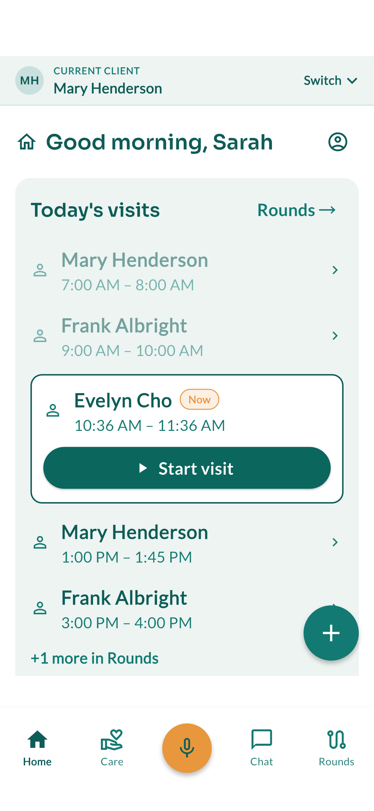
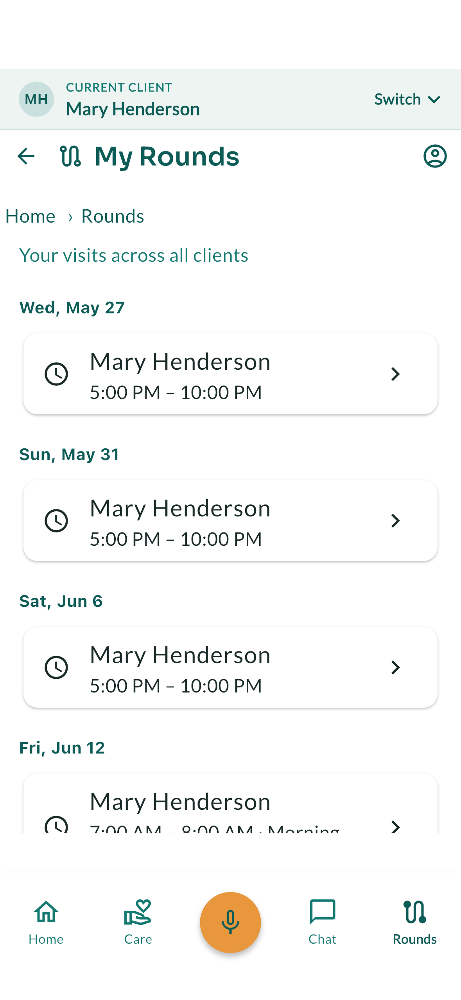
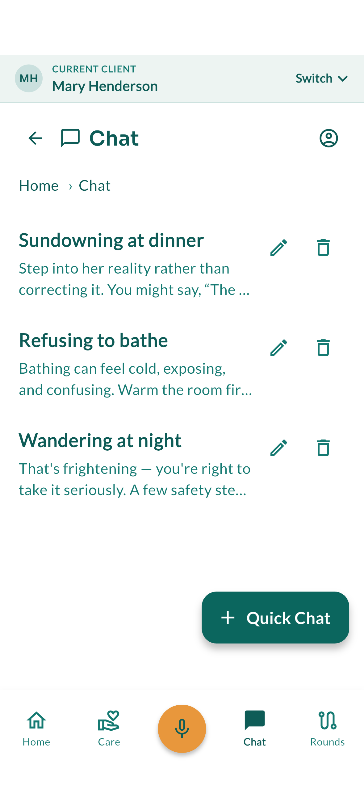
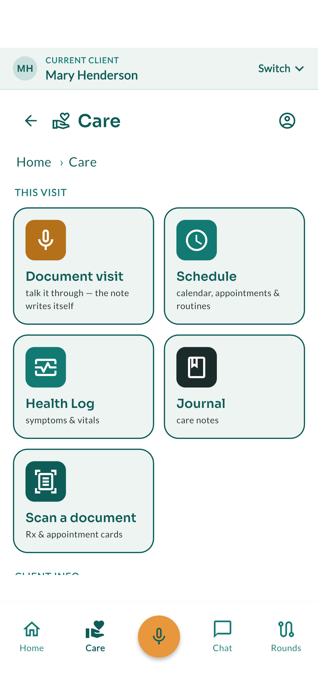
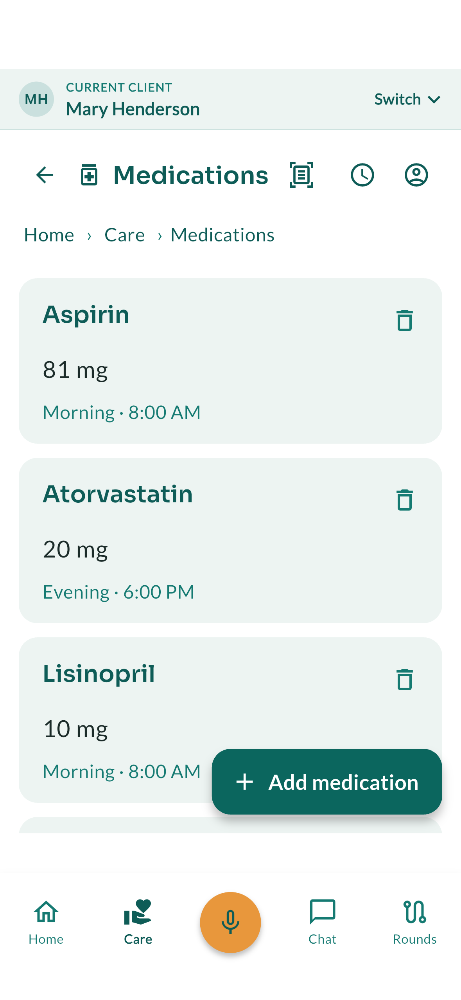
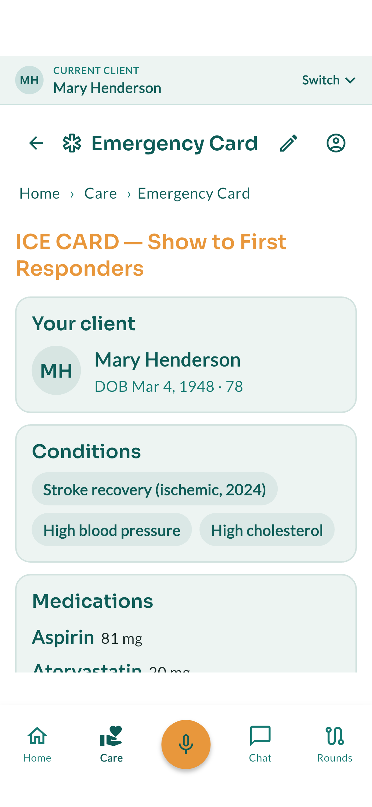

# Care Rounds

**An AI care-operations app for the direct-care workforce — so aides spend their shift on care, not paperwork.**

Care Rounds is a mobile app (iOS + Android) for home health aides, personal care
aides, and direct support professionals — the fastest-growing and one of the most
strained occupations in the country. Workers spend a large share of every shift
on documentation and coordination instead of care, and agencies can't hire their
way out of the shortage. Care Rounds gives that time back **per worker**.

🌐 **[junocode.studio/carerounds](https://junocode.studio/carerounds/)** · iOS + Android · in active testing

> **Entry in the ACL / HHS Caregiver AI Prize Challenge — Track 2 (AI tools for
> extending the caregiver workforce).** **Dementia care is central to this
> workforce's day:** many home-care and direct-support clients live with
> dementia, and Care Rounds' ambient visit documentation, client-grounded
> coaching, supervisor escalation, and early-warning flags are built for aides
> supporting clients with dementia and other complex, high-acuity needs.

## Screenshots

<p align="center">
  
  
  
</p>
<p align="center">
  
  
  
</p>

## The flagship: ambient visit documentation

The aide **talks through a visit** — or lets the **scribe** listen right through
a longer one — and the AI turns it into an **approvable checklist**, not a
paragraph. Each thing it heard becomes its own line, grouped as *Care given /
What I noticed / To pass on*. The worker checks what is right, corrects the
wording in place, drops what is wrong, and adds whatever was missed. **Only
checked lines are written**, and an unchecked line stays visible, struck through,
so the worker can see what the AI heard and chose not to keep.

That is the difference between a review and a rubber stamp: a wrong claim can be
rejected on its own instead of hunted down inside a paragraph. Nothing is filed
from memory at the end of a long shift, and nothing is filed without an explicit
approval.

## Built around a real caseload

Aides don't see one client a day — they run a route. Care Rounds is organized the
way they actually work:

- **Today's visits** — a cross-client view of the day's route, with a "Start
  visit" flow that focuses the app on the client in front of the worker.
- **Persistent client switcher** — always know, and change, whose care you're
  looking at.
- **Client-grounded AI coach** — practical, in-scope guidance for the specific
  person being cared for, grounded in that client's real care information.
- **Supervisor escalation** — a code-side path to flag something for a supervisor,
  with a supervisor-flag inbox, so concerns reach the right person quickly.
- **Explainable early-warning flags** — rule-based, reason-stating alerts
  (repeated falls, a medication running low, late-day agitation clustering)
  surfaced from the data the worker already enters — not a black-box score.
  A second set of rules names no behavior in advance: they read a client's own
  "what works" record and report whichever pattern emerges in it — a situation
  recurring, clustering in one part of the day, or defeating everything tried
  so far — so the app is not limited to the patterns anyone thought of.
- **The scribe** — for a longer visit, listen right through it instead of
  composing the account at the end. Transcription runs **on the phone itself**
  on both iOS and Android, so the audio never leaves the handset; it will not
  start until the worker has read the on-screen disclosure aloud and recorded
  how the client agreed. Voices are separated so the worker's speech is kept
  apart from the room's — people are never identified by voice.
- **"What works"** — what a worker tried in a hard moment and whether it helped,
  kept against the *client* and shared across their whole team, so the practical
  knowledge of how to approach a particular person survives the sector's
  turnover instead of leaving with whoever figured it out. It grounds the coach
  too. This is the dementia focus of the Track-2 meritorious submission.
- **AI-guided care-plan checklist** — the plan for a visit, approved task by task.

## You never have to type

The whole point is that the worker **talks** — and the app does the writing. The
flagship visit note is spoken, not typed; and every other core action — log a
dose, record a symptom, flag a client for a supervisor, note a task, add a
medication — can be done **by voice or by snapping a photo**, with a review step
before anything saves. An aide moving between visits, gloved-up, or not confident
typing on a phone can still keep documentation complete and on time — no forms, no
end-of-shift catch-up. **You just talk.**

## Responsible AI, by design

The guardrails are structural — they don't depend on which model is running:

- **Supports the worker; never diagnoses or prescribes.** The coach stays within
  an aide's scope, defers medical decisions to clinicians, and — when unsure —
  flags and escalates rather than guessing.
- **Human-in-the-loop on every change.** The ambient note is reviewed before it
  saves; care-plan tasks are approved individually; destructive actions never
  auto-execute.
- **The vendor is invisible.** The AI runs on our own cloud (an open-weight model
  on Cloudflare Workers AI), so client care data never reaches a separate AI
  vendor.
- **Validated.** Live safety cycles through the actual Care Rounds coach held
  every guardrail (dosing, diagnosis, prompt-injection, unknown-instruction, and
  crisis probes), backed by a code-side crisis watchdog and prompt sanitization
  pinned by the test suite.

## What it is *not*

Care Rounds is a care-quality and documentation tool, deliberately **not** an
electronic-visit-verification (EVV) system, a billing/claims/payroll platform, a
scheduling-optimization engine, or an applicant-tracking system. It complements
the systems an agency already runs.

## Under the hood

Flutter (Dart) · Riverpod · go_router · Drift (SQLite) · a Cloudflare Worker
backend (Hono + D1 + R2 + Workers AI). Care data is **local-first** and encrypted
at rest by the OS; team sync is authenticated and TLS-encrypted. Care Rounds
shares a tested backbone with **Holdclose**, our companion app for family
caregivers — two sides of one care team.

Care Rounds is an entry in the **ACL / HHS Caregiver AI Prize Challenge**
(Track 2 — AI tools for extending the caregiver workforce).

Quality is enforced by a large automated suite — **~1,900+ unit, widget, and
golden tests** plus a backend suite — run on every change.

## Serverless on Cloudflare — scales far, costs little

The entire backend is **serverless on Cloudflare**: Workers for edge compute,
D1 (SQLite) for data, R2 for files, and **Workers AI** for the coach and ambient
visit notes — an **open-weight model on Cloudflare's serverless GPU platform**.

**Scales without bottlenecks.** Compute and AI inference scale automatically
across Cloudflare's global network — **no servers or GPUs to provision, no cold
starts** — and fall to zero cost when idle. Adding agencies and workers doesn't
create a bottleneck or a step-change in cost; the one part that needs deliberate
scaling at very high volume is the database (D1 read replicas), standard for any
architecture.

**Costs a fraction of the usual stack.** Pay-per-request with scale-to-zero means
**no idle burn** — unlike an always-on AWS deployment (EC2/RDS billed around the
clock, S3 charging egress on every file served); R2 has **zero egress fees**. And
running an **open-weight model on serverless GPUs costs roughly an order of
magnitude less per token** than a frontier hosted API (a GPT‑4‑ or Claude‑class
model). That's what keeps the price low enough for **thin-margin agencies and a
near-minimum-wage workforce** — and it keeps the AI on **our own cloud**, so
client care data never reaches a separate AI vendor.

## Development

```bash
flutter pub get
flutter test                 # full suite (unit + widget + golden)
flutter analyze
cd backend && npm test       # Cloudflare Worker suite
```

The app runs against a backend for auth and sync; a local development shim wraps
a CLI for dev-mode AI calls, so there are no API keys in source.

## License

© JCSV One LLC (Juno Code Studio). All rights reserved. The source is made
available for evaluation and is **not** licensed for reuse, redistribution, or
derivative works.
